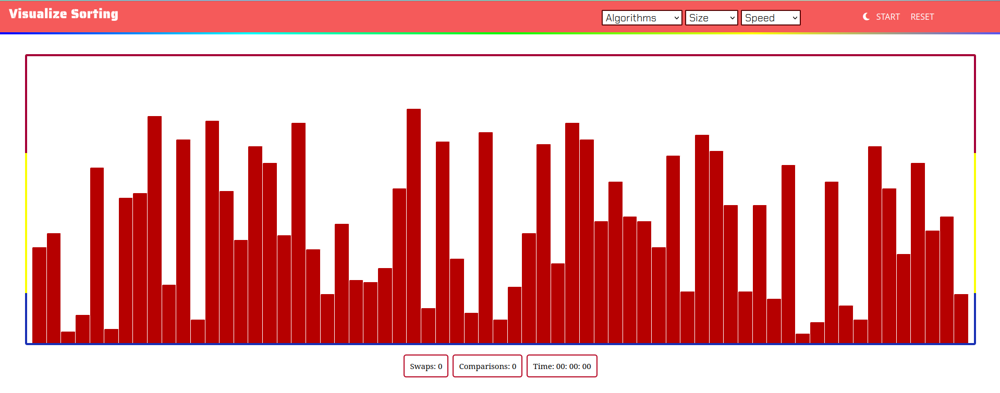

# VisualizeSorting

 🖇️ Deployed Link : https://deepak91168.github.io/VisualizeSorting/

 A web application hosted on github pages, designed to showcase the visualization of renowned sorting algorithms including bubble sort, insertion sort, selection sort, merge sort, and quick sort.

## Tech Stack

   


## Installation

- Fork the Repository and clone it at the desired location

```bash
  git clone https://github.com/<UserName>/VisualizeSorting.git
```
- Open Repository
```bash 
   cd VisualizeSorting
```
- Open `index.html` with your browser or run using liveServer.

## Screenshot



## Contributing

Contributions are always welcome :)

Can work upon the [issues](https://github.com/Deepak91168/VisualizeSorting/issues) mentioned or can create new issues as well.
#### Guideline
1. Fork the Repository
2. Create your featureBranch.
3. Commit your changes (`git commit -m "Added amazingFeature"`)
4. Push to the branch (`git push origin feature/amazingFeature`)
5. Open up a Pull Request.

## References

You can refer the following documentation for any issue!

- HTML
````
  https://developer.mozilla.org/en-US/docs/Web/HTML
````
- CSS
````
https://developer.mozilla.org/en-US/docs/Web/CSS
````
- JavaScript

````
https://developer.mozilla.org/en-US/docs/Web/JavaScript
````
